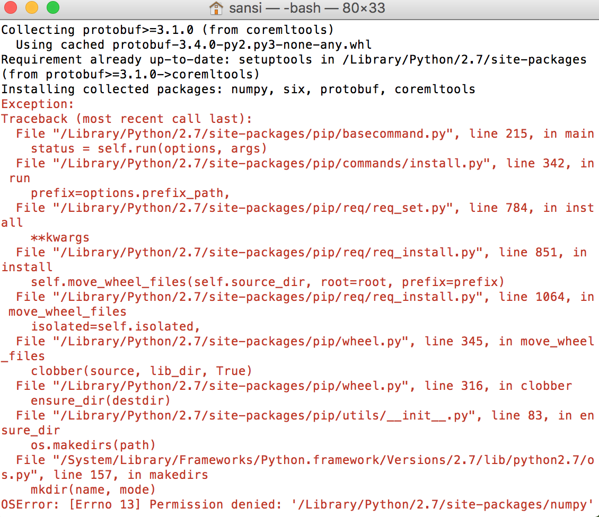

# CoreMLModel

CoreML创建自己的.mlmodel的心酸历程，足足摆弄了半天，各种坑。

### [Permission denied]问题

* pip install -U coremltools

* 从图也可以看出coremltools包含numpy,six,protobuf,coremltools。
因为权限问题导致失败

*  sudo pip install -U coremltools
*  遇到[Permission denied]都要加sudo

### ImportError: No module named pkg_resources 问题

* Step: 1 Login in root user.
<pre>
sudo su root
</pre>
     
* Step: 2 Uninstall python-pip package if existing.
<pre>
apt-get purge -y python-pip
</pre>

* Step: 3 Download files using wget command(File download in pwd )
<pre>
wget https://bootstrap.pypa.io/get-pip.py
</pre>

* Step: 4 Run python file.
<pre>
python ./get-pip.py
</pre>

* Step: 5 Finaly exicute installation command.
<pre>
apt-get install python-pip
</pre>

Note: User must be root.</dic>

好吧，这两个问题遍布整个流程，期间各种小问题我已经不记得了，接下来就开始正文了

1. 下载coremltools
 <pre>sudo pip install -U coremltools</pre>

2. 下载pip.py文件
<pre>sudo python get-pip.py</pre>

3. 下载scikit-learn
<pre>sudo pip install -U numpy scipy scikit-learn</pre>

4. 下载panda
<pre>sudo pip install pandas</pre>

准备就绪，开工

#### 创建csv文件
1. csv文件属性Square_Feet，Price
2. 记录文件所存储位置，调用的时候需要

#### 在终端输入生成.mlmodel文件
1. 导入需要的类
2. 调用csv文件
3. coremltools转换成.mlmodel文件
4. author,license,description描述
5. 输入Square_Feet，输出Price，保存

* >>> import coremltools
* >>> from sklearn.linear_model import LinearRegression
* >>> import pandas as pd
* >>> data = pd.read_csv('/Users/sansi/Desktop/CoreMLModel/input_data.csv')
* >>> model = LinearRegression()
* >>> model.fit(data[["Square_Feet"]], data["Price"])
* >>> coreml_model = coremltools.converters.sklearn.convert(model, "Square_Feet", "Price")
* >>> coreml_model.author = 'tongle'
* >>> coreml_model.license = 'BSD'
* >>> coreml_model.short_description = 'Predicts the price of a house in the Seattle area.'
* >>> coreml_model.input_description['Square_Feet'] = 'Size (in square feet)'
* >>> coreml_model.output_description['Price'] = 'Price of the house'
* >>> coreml_model.save('HousePricer.mlmodel')
* >>> 

如果没有一点python功底，我都要死在电脑前了，哈哈

